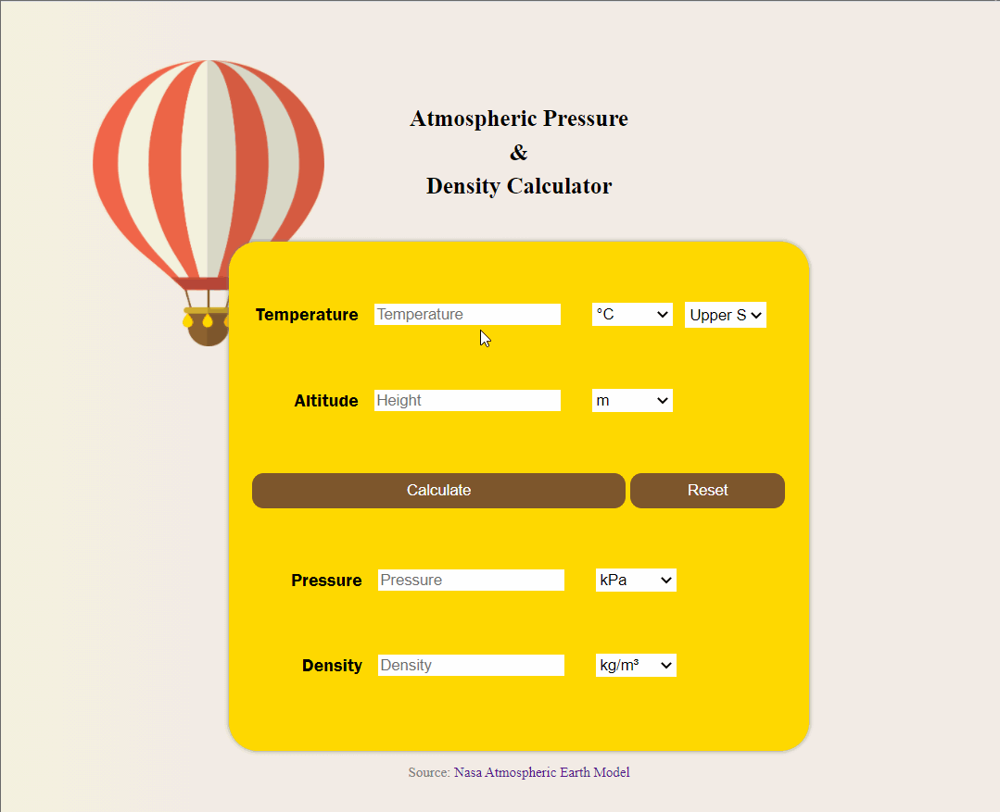

# Atmospheric-and-Density-Calculator
Atmospheric and Density Calculator made using the NASA Atmospheric Earth Model.

## Walkthrough

GIF created with [LiceCap](http://www.cockos.com/licecap/).

## Licenses
Copyright 2020 Mohammad Rahman

   Licensed under the Apache License, Version 2.0 (the "License");
   you may not use this file except in compliance with the License.
   You may obtain a copy of the License at

       http://www.apache.org/licenses/LICENSE-2.0

   Unless required by applicable law or agreed to in writing, software
   distributed under the License is distributed on an "AS IS" BASIS,
   WITHOUT WARRANTIES OR CONDITIONS OF ANY KIND, either express or implied.
   See the License for the specific language governing permissions and
   limitations under the License.
